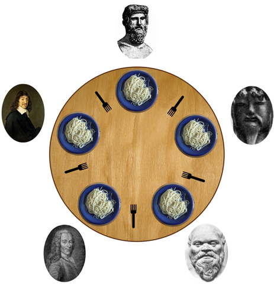

# Weekly Assignments 2

Note that some tasks may deliberately ask you to look at concepts or libraries
that we have not yet discussed in detail. But if you are in doubt about the scope
of a task, by all means ask.
Please try to write high-quality code at all times! This means in particular that
you should add comments to all parts that are not immediately obvious.

## W2.1 Packaging

Prepare a Cabal package to contain all your solutions so that it can easily be
built using cabal-install or stack.
Note that one package can contain one library (with arbitrarily many modules)
and possibly several executables and test suites.
Please include aREADMEfile in the end explaining clearly where within the
package the solutions to the individual subtasks are located.
For task W2.4, include a text file in the package containing the solution.

The project exercise P1 is not to be included in the package, and handled
separately.

Please do _NOT_ try to upload your package to Hackage.

## W2.2 Dining Philosophers

The Dining philosophers problem is a classic problem to demonstrate synchro-
nization issues in concurrent programming and ways to resolve those problems.



_By Benjamin D. Esham / Wikimedia Commons, CC BY-SA 3._

n philosophers sit aroung a table, between each of them lies a fork. We label
philosophers and forks by the numbers from 1 ton(counterclockwise), such that
fork #1 is the fork between philosophers #1 and #2, fork #2 is the fork between
philosophers #2 and #3 and so on.

The philosophers are hungry from their discussions and want to eat. In order
to eat, a philosopher has to pick up the fork to his left and the fork to his
right. Once he has both forks, he eats, then puts the forks down again, then
immediately becomes hungry again and again wants to eat.

We model each philosopher as its own concurrent Haskell thread. For each of
the subtasks, log some output to the screen, so that you can observe which
philosopher is holding which fork and which philosopher is eating. You may
need to come up with a way to ensure that the log output is not garbled, even
though all philosopher threads try to log concurrently.

Provide one executable for each subtask, where n can be provided as a command
line argument. Keep the executables as small as possible and implement most
code in the library.

Try to share as much code as possible between subtasks!

```haskell id="P02" file="src/P02.hs"
module P02 where
```

### Subtask 2.2.1

First we want to demonstrate the danger of deadlock. Use an =MVar()= for each
fork, where an empty =MVar= means that the fork has been picked up. Implement
the philosophers by having them always pick the left fork first, then the right
fork.

Observe that very soon, there will be deadlock.

### Subtask 2.2.2

One classic strategy for deadlock avoidance is to impose a _global order_ on the
order in which locks are taken. Change your deadlock-prone program from above
in such a way that now, each philosopher first tries to pick up the fork _with the
lower number_ , then the fork _with the higher number_.

Observe that the deadlock problem is fixed and that the philosophers can all eat.

### Subtask 2.2.3

Finally, we want to see how using =STM= avoids the deadlock problem without the
need for any global order of locks: Represent forks asTVar Bool’s, where value
Falsemeans that the fork is on the table,Truemeans it has been picked up.
Have the philosophers try to pick up the left fork first, then the right one.
Observe that again, we have no deadlock.

## W2.3 Unsafe IO

In this task, we’re going to show that =unsafePerformIO :: IO a -> a= is not
just a function that can lead to unpredictable results, but it can in fact be really
dangerous and lead to crashes such as segmentation faults.
For this, we’re going to combine =unsafePerformIO= with mutable references, so
you will need the following modules:

```haskell id="P03" file="src/P03.hs"
-- | W2.3 Unsafe IO
module P03 where

import           Data.IORef
import           System.IO.Unsafe               ( )
```

### Subtask 2.3.1

Just to practice working with =IORefs=, write a function

```haskell id="P03"
-- | Subatask 2.3.1
relabelTree :: Tree a -> IO (Tree (a, Int))
relabelTree = undefined

data Tree a = Leaf a | Node (Tree a) (Tree a)
```

that assigns unique integer labels from left to right to all of the leaves, starting
from 0. This time, we do not want to use the =State type=, but simply make use
of an =IORef Int= to hold the counter.
In this part, you should not use =unsafePerformIO=.

### Subtask 2.3.2

Use =unsafePerformIO= to define a value of type

```haskell id="P03"
-- | Subtaks 2.3.2
anything :: IORef a
anything = undefined
```

Can you see why the presence of such a value is dangerous?

### Subtask 2.3.3

Use =unsafePerformIO= and anything to define a function

```haskell id="P03"
-- | Subtaks 2.3.3
cast :: a -> b
cast = undefined
```

that abandons all type safety. Play with cast a bit and see what happens if you
cast various types into each other. Can you find cases where this actually works?
And why? Can you also find cases where this reliably crashes?

## W2.4 Equational reasoning

Assume the following definitions:

```haskell id="P04" file="P04.txt"
-- | W2.4 Equational reasoning
data Tree a = Leaf a | Node (Tree a) (Tree a)

size :: Tree a -> Int
size (Leaf a  ) = 1
size (Node l r) = size l + size r

flatten :: Tree a -> [a]
flatten (Leaf a  ) = [a]
flatten (Node l r) = flatten l ++ flatten r

length :: [a] -> Int
length []       = 0
length (x : xs) = 1 + length xs

(++) :: [a] -> [a] -> [a]
[]       ++ ys = ys
(x : xs) ++ ys = x : (xs ++ ys)
```

### Subtask 2.4.1

Prove the following property:

```haskell id="P04"
-- | Subtask 2.4.1
-- forall (xs :: [a]) (ys :: [a])
-- length (xs ++ ys) = length xs + length ys
```

### Subtask 2.4.2

Prove the following property:

```haskell id="P04"
-- | Subtask 2.4.1
-- forall (t :: Tree a).
-- length (flatten t) = size t
```

## W2.5 Transactions

In most cryptocurrencies, transactions map a number of inputs to a number of
outputs, roughly as follows:

```haskell id="P05" file="src/P05.hs"
-- | W2.5 Transactions
module P05 where

  import Data.Map
  <<transaction_output_definition>>
  <<transaction_input_definition>>

  data Transaction = Transaction { tId :: Id
                               , tInputs :: [Input]
                               , tOutputs :: [Output]
                               } deriving (Show)

  type Id = Int
```

The =Id= is simply a unique identifier for the transaction.

The idea is that all the inputs are completely consumed, and the money contained
therein is redistributed to the outputs.

An Output is a value indicating an amount of currency, and an address of a
recipient. We use =String= to model addresses, and keep values all as integers.

```haskell id="transaction_output_definition"
data Output = Output { oValue :: Int
                     , oAddress :: Address
                     } deriving (Show)

type Address = String
```

An Input must actually refer to a previous output, by providing an Id of a
transaction and a valid index into the list of outputs of that transaction.

```haskell id="transaction_input_definition"
data Input = Input
 { iPrevious :: Id
 , iIndex :: Index
 }
 deriving (Show, Eq, Ord)

type Index = Int
```

In processing transactions, we keep track of “unspent transaction outputs”
(UTXOs) which is a map indicating which outputs can still be used as inputs:

```haskell id="P05"
  type UTXOs = Map Input Output
```

The outputs contained in this map are exactly the unspent outputs. In order to
refer to anOutput, we need its transaction id and its index, therefore the keys
in this map are of typeInput.

### Subtask 2.5.1

A transaction is called _valid_ if all its inputs refer to unspent transaction outputs,
and if the sum of the values of its outputs is smaller than or equal to the sum
of the values of its inputs. (In real cryptocurrencies, the amount by which it is
smaller is usually considered to be the transaction fee and not lost, but reassigned
to the block creator in a special transaction. But in our small example, that
money simply disappears.)
In the light of this, implement a function
processTransaction :: Transaction -> UTXOs -> Either String UTXOs
that checks if a transaction is valid and at the same time updates the UTXOs by
removing the ones that are used by the transaction. If the transaction is invalid,
an error message should be produced.

Then, write a function

```haskell id="P05"
-- | Subtask 2.5.1
  processTransactions :: [Transaction] -> UTXOs -> Either String UTXOs
  processTransactions = undefined
```

that processes many transactions in sequence and aborts if there is an error.

### Subtask 2.5.2

Construct a number of small example transactions and an initial state of unspent
transaction outputs (that determines the initial money distribution, because
we have no way to create money here), and verify thatprocessTransactions
behaves as intended.

```haskell id="P05"
-- | Subtask 2.5.2

```

### Subtask 2.5.3

For the previous subtask, you will have to write several functions of the type

```haskell id="P05"
-- | Subtask 2.5.3
--   Redefine UTXOs as
--  type UTXOs = Either String (a, UTXOs)
```

This looks like a combination of the =State= type with =Either=.

Let’s define

```haskell id="P05"
  newtype ErrorState s a = ErrorState {runErrorState :: s -> Either String (a, s)}

```

Define aMonadinstance (and the implied =Functor= and =Applicative= instances)
that combines the ideas of the monad instances forEitherandState, i.e., it
aborts as soon as an error occurs (with an error message), and it threads the
state through the computation.

Also define the functions:

```haskell id="P05"

  throwError :: String -> ErrorState s a
  throwError = undefined

  get :: ErrorState s s
  get = undefined

  put :: s -> ErrorState s ()
  put = undefined
```

in similar ways as we had done for the individual monads.

### Subtask 2.5.4

Rewrite processTransactions and all the helper functions to
use the =ErrorState= type

```haskell id="P05"
-- | Subtask 2.5.4

```

## Examples for W2.5 (Transactions)

Let’s look at some example transactions to see howUTXOsand transactions work!

We importData.Map _qualified_ :

```haskell id="examples" file="test/P05Spec.hs"
module P05Spec where

import           P05
import qualified Data.Map                      as M

```

and start with initial UTXOs:

```haskell id="examples"
genesis :: UTXOs
genesis = M.fromList [(Input 0 (-1), Output 10000 "John")]

```

So in the beginning, John is the only person owning any money, and he has 10000.

The corresponding Input references a non-existent =Transaction with Id= 0
and a non-existing index(-1), but that’s fine - we have to bootstrap _somehow_.

Next, let’s imagine John wants to pay a _per diem_ of 1500 each to Lillian, Meron
and Melikte, so he creates a corresponding =Transaction=:

```haskell id="examples"
perDiem :: Transaction
perDiem = Transaction
  { tId      = 1
  , tInputs  = [Input 0 (-1)]
  , tOutputs = [ Output 1500 "Lillian"
               , Output 1500 "Meron"
               , Output 1500 "Melikte"
               , Output 5500 "John"
               ]
  }
```

Note the last output - it’s the _change_ of his 10000 that he wants to keep for
himself! Now let’s _process_ this transaction!

```haskell id="examples"
spec :: Spec
spec = do
  describe "process UTXos" $ do
    context "John pay's 1500 to Lillian, Meron and Melikte" $ do
      it "is valid trancation and spent input has been removed" $ do
        let Right utxos1 = processTransaction perDiem genesis
        utxos `shouldBe` M.fromList
          [ (Input 1 0, Output 1500 "Lillian")
          , (Inout 1 1, Output 1500 "Meron")
          , (Input 1 2, Output 1500 "Melikte")
          , (Input 1 3, Output 5500 "John")
          ]
     <<next_transaction>>
```

Transaction perDiem is _valid_ , so process Transaction evaluates to a Right
containing the updated UTXOs, where the spent input has been removed and the
four new outputs have been added.

Next, let’s assume Meron and Melikte want to share injera for lunch together,
so they create a new transaction paying the restaurant 100:

```haskell id="examples"
lunch :: Transaction
lunch = Transaction
  { tId      = 2
  , tInputs  = [Input 1 1, Input 1 2]
  , tOutputs = [ Output 100  "Bethel's Fine Ethiopian Food"
               , Output 1440 "Meron"
               , Output 1440 "Melikte"
               ]
  }
```

So this transaction has _two_ inputs, because Meron and Melikte both contribute.
Accordingly, there are outputs for both of them. Also note that the sum of
inputs is 3000, but the sum of outputs is only 2980 - so they decided to give 10
each as transaction fees.

This is again a validTransaction, soprocessTransactionwill again succeed:

```haskell id="next_transaction"
 context "Meron and Melikte want to share lunch together" $ do
   it "is valid, and two inputs have been removed" $ do
     let Right utxos2 = processTransaction lunch utxos
     utxos `shouldBe` M.fromList
       [ (Input 1 0, Output 1500 "Lillian")
       , (Input 1 3, Output 5500 "John")
       , (Input 2 0, Output 100 "Bethel's Fine Ethiopian Food")
       , (Input 2 1, Output 1440 "Meron")
       , (Input 2 2, Output 1440 "Melikte")
       ]

```

Note that two inputs have been removed from the =UTXOs=, and three new ones
have been added.
`
Also remember that there are two ways in which a Transaction can be invalid:
If one of the inputs does not exist in theUTXOsor if the sum of inputs is less
than the sum of outputs.
Hope this helps!
